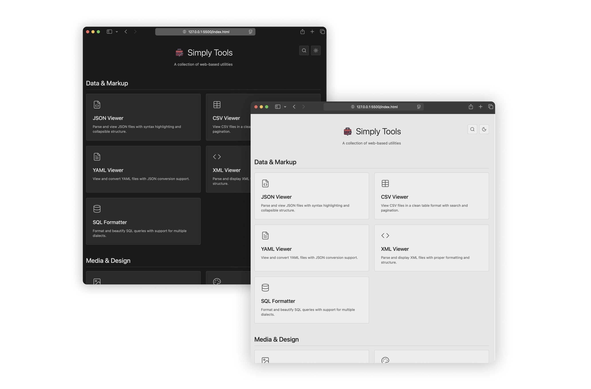

  
  <h1>Simply Tools</h1>
  
<i>No ads. No clutter. Just tools that work.</i>

  

## About
Simply Tools is a collection of everyday web utilities that run entirely in your browser.  
- Instant access, no installs or sign-ups  
- Privacy-first: data never leaves your device  
- Clean, distraction-free design  

‎ 

  Lightweight • Private • Always free 
  Made for students, developers, creators  and anyone who values simplicity.

